# IncidentIQ – AI Powered Incident Management System


IncidentIQ is a full-stack incident management platform designed to streamline IT support workflows using role-based authentication, ticket management, analytics dashboards, audit logging, and AI-powered ticket prioritization.

---

## Live Demo

🔗 https://incidentiq-ke99.onrender.com

---

## GitHub Repository

🔗 https://github.com/KARANPANWAR12/IncidentIQ

---

## Features

### Authentication

* Admin Login
* Employee Login
* Session Management
* Password Hashing using Flask-Bcrypt

### Incident Management

* Raise Tickets
* View Tickets
* Update Ticket Status
* Priority Management
* Category-based Incidents
* Escalation Workflow
* Audit Logging

### AI Features

* AI-based Ticket Priority Prediction
* Automatic Priority Assignment using keyword analysis

### Dashboard

* Total Tickets
* Open Tickets
* In Progress Tickets
* Resolved Tickets
* Escalated Tickets
* Recent Activity Analytics

### Notifications

* Simulated Email Notifications
* Audit Logs and Status Tracking

---

## Tech Stack

### Frontend

* HTML5
* CSS3
* JavaScript
* Jinja2 Templates

### Backend

* Python
* Flask
* Flask-Login
* Flask-Bcrypt
* Flask-MySQLdb

### Database

* MySQL
* Railway Cloud Database

### Deployment

* Render
* GitHub

---

## Project Structure

```text
IncidentIQ/
│
├── app/
│   ├── routes/
│   ├── static/
│   ├── templates/
│   ├── models.py
│   ├── ai_priority.py
│   └── email_simulation.py
│
├── screenshots/
├── database_setup.sql
├── requirements.txt
├── Procfile
├── render.yaml
├── run.py
├── seed_users.py
└── README.md
```

---

## Installation

### Clone Repository

```bash
git clone https://github.com/KARANPANWAR12/IncidentIQ.git
cd IncidentIQ
```

### Create Virtual Environment

```bash
python -m venv venv
venv\Scripts\activate
```

### Install Dependencies

```bash
pip install -r requirements.txt
```

### Configure Environment Variables

Create a `.env` file:

```env
SECRET_KEY=
MYSQLHOST=
MYSQLPORT=
MYSQLDATABASE=
MYSQLUSER=
MYSQLPASSWORD=
```

### Run Project

```bash
python run.py
```

---

## Default Credentials

### Admin

Username:

```text
admin
```

Password:

```text
admin123
```

### Employee

Username:

```text
employee
```

Password:

```text
emp123
```

---

## Database Tables

* users
* tickets
* audit_logs

---

## Screenshots

### Login Page

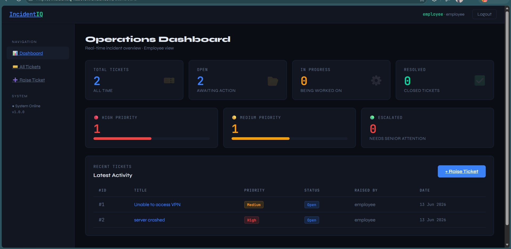

### Employee Dashboard


### Employee Dashboard (More Tickets)

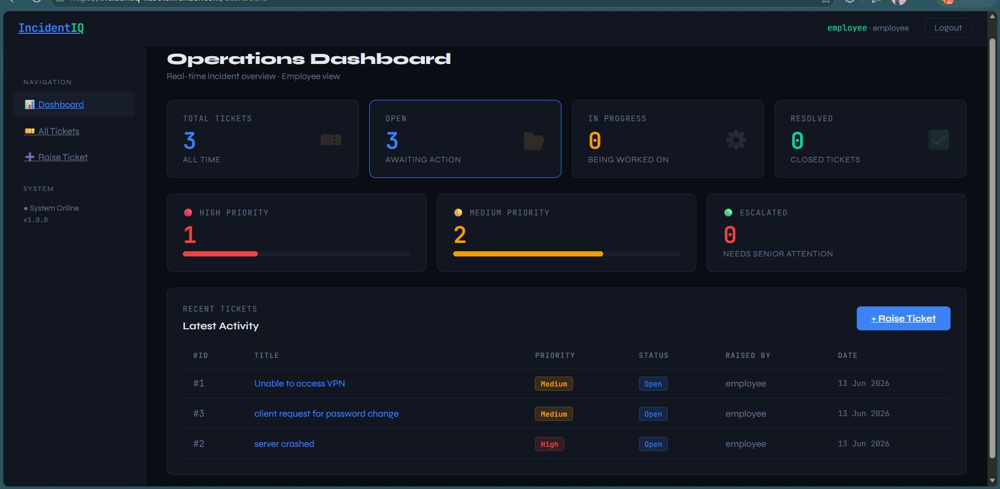

### Admin Dashboard

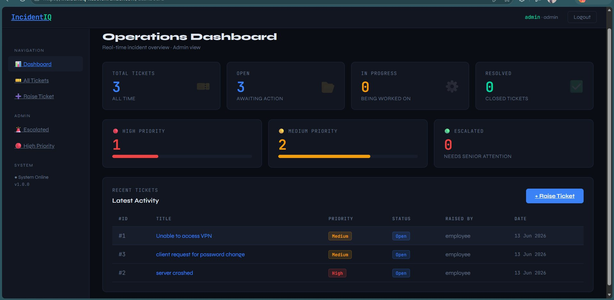

### Admin Dashboard (Escalated Tickets)

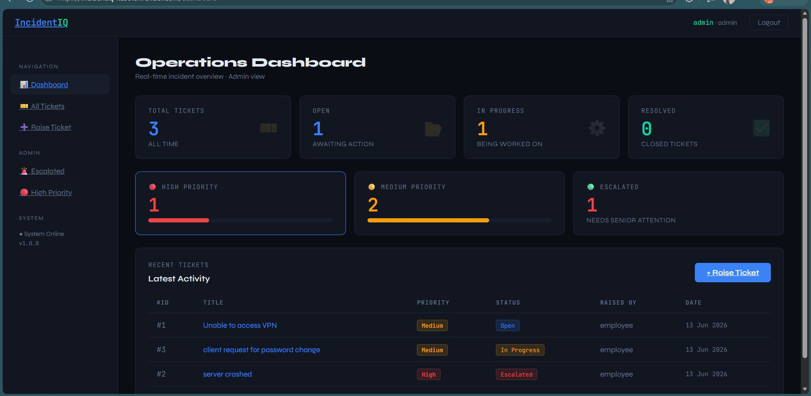

### Admin Dashboard (In Progress Tickets)

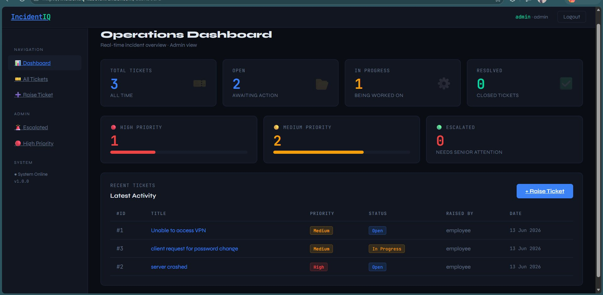

### AI Priority Prediction

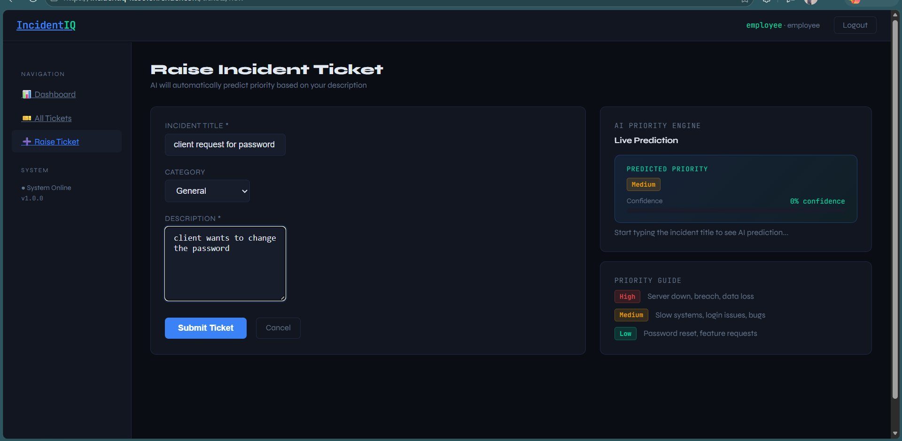

### Ticket Queue

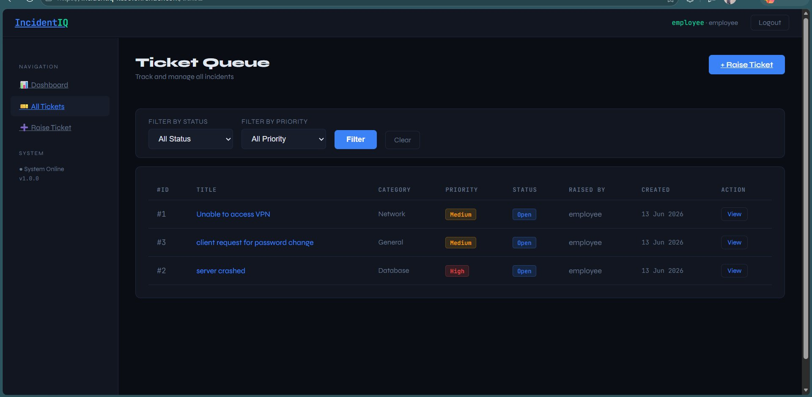

### Admin Ticket Queue

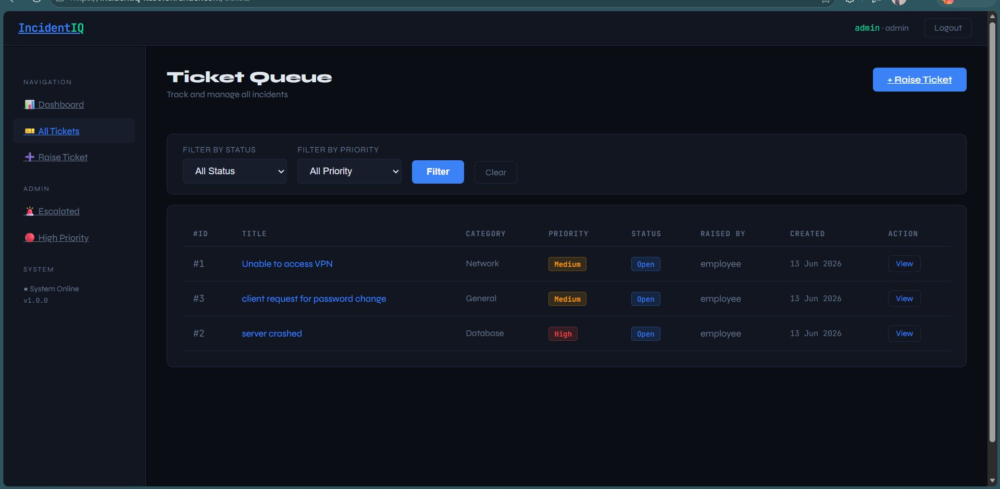

### Audit Trail

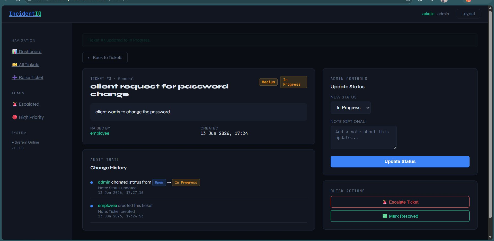

### Escalated Ticket

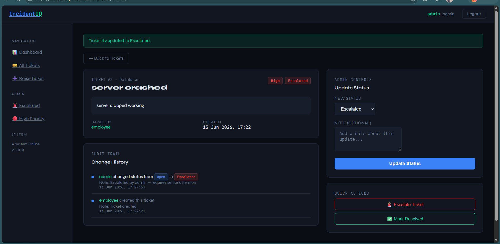

### High Priority Filter

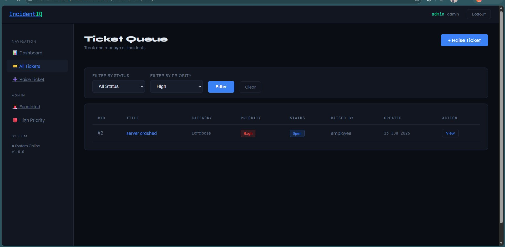

### Resolved Ticket

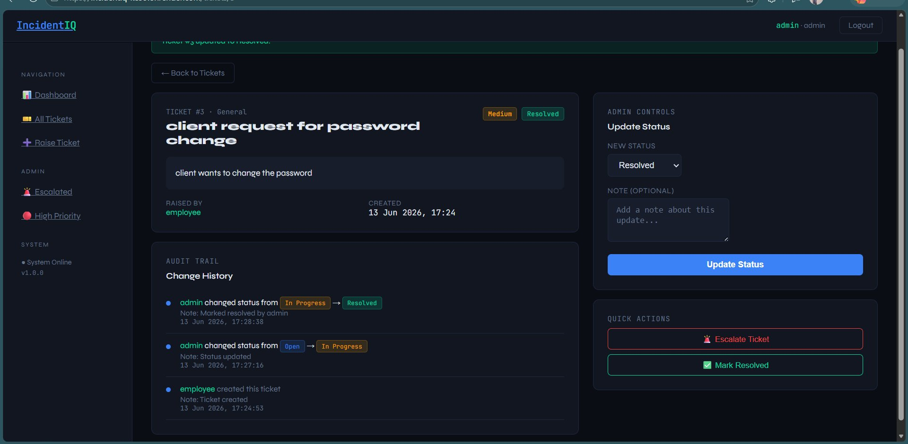

### Final Dashboard

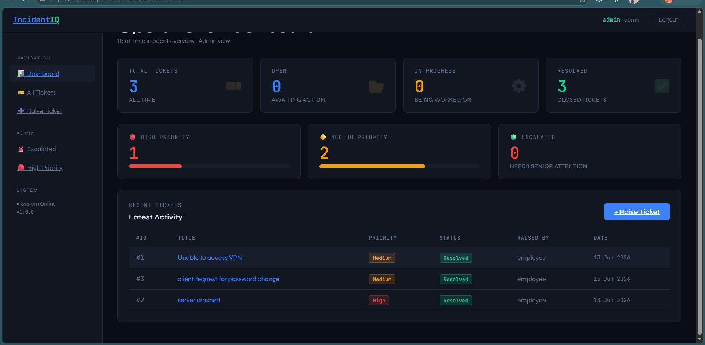

### Logout Screen

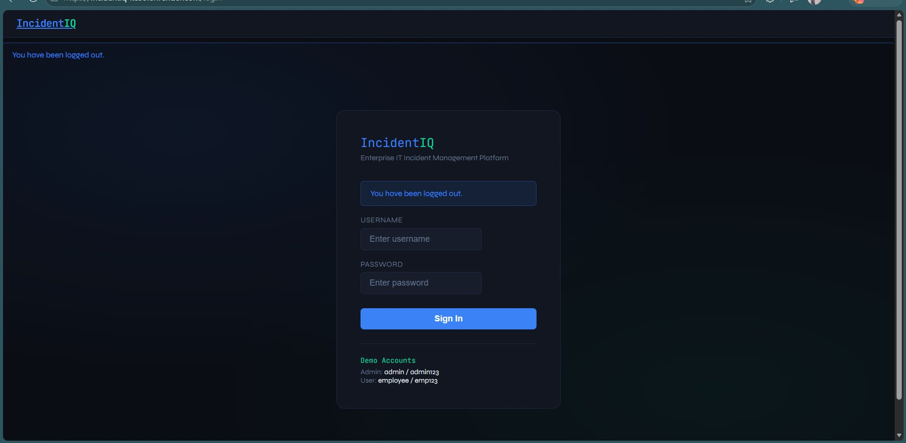

---

## Future Enhancements

* Real Email Notifications
* Machine Learning Based Incident Classification
* File Attachments
* REST API
* JWT Authentication
* Docker Support
* Real-time Notifications

---

## Author

**Karan Panwar**

B.Tech Computer Science Engineering  
Graphic Era Hill University, Dehradun, Uttarakhand, India

GitHub: https://github.com/KARANPANWAR12

LinkedIn: [Karan Panwar](https://www.linkedin.com/in/karan-panwar-427822353/)

Live Demo: https://incidentiq-ke99.onrender.com

---

## License

This project is developed for educational and portfolio purposes.
